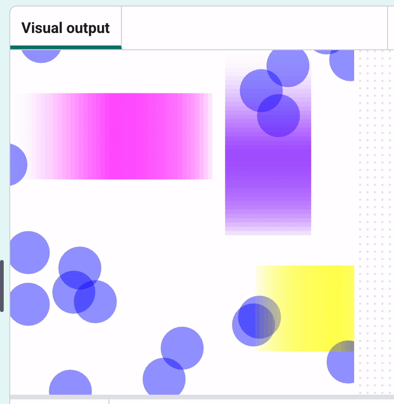

<h2 class="c-project-heading--task">What you will make</h2>
--- task ---
Experiment with different shapes to make a colourful design.
--- /task ---

<iframe src="https://editor.raspberrypi.org/en/embed/viewer/editor-powerfull-patterns-example" width="600" height="600" frameborder="0" marginwidth="0" marginheight="0" allowfullscreen>
</iframe>

