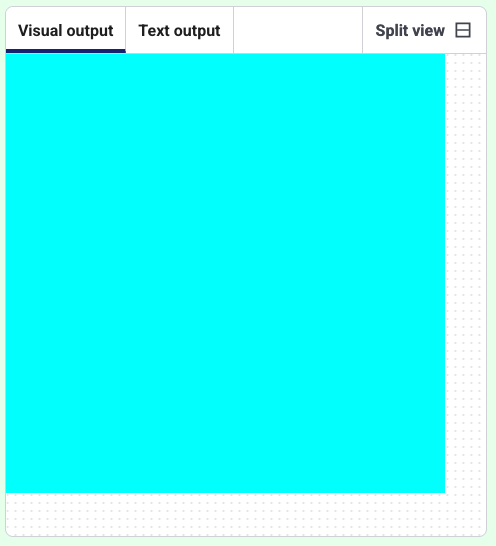

<h2 class="c-project-heading--task">Style the background</h2>

Get started by adding the code below to make a background.

<h2 class="c-project-heading--explainer">Follow these instructions</h2>

Change the `background` colour by experimenting with different values in the starter code.

### Red, green, blue

The maximum amount of red, green, or blue is `255`. Make sure all your `background` colour values are between `0` and `255`.

 

--- code ---
---
language: python
line_numbers: true
line_number_start: 1
line_highlights: 5-6
---
from p5 import *
from random import randint

def setup():
    size(400, 400)
    background(0, 255, 255) # change background colour
--- /code ---

## Now run your code

Run your project and check that the **Visual output** background changes to the new colour.
