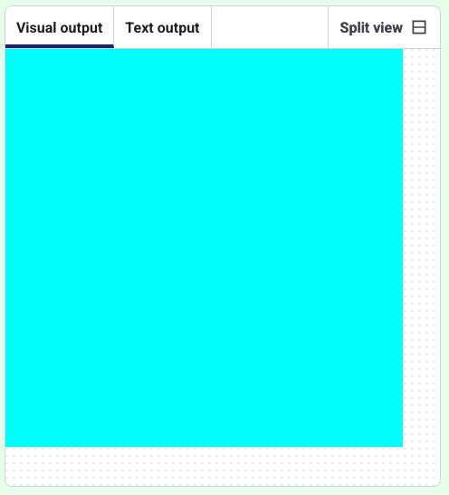

## Style the background

Add the code below to make a background.

To change the `background` colour, experiment with different values in the starter code.

> [!INFO]
>
> ## Red, green, blue
>
> The maximum amount of red, green, or blue is `255`. Make sure all your `background` colour values are between `0` and `255`.

```python line_numbers="true" line_number_start="1" line_highlights="5-6"
from p5 import *
from random import randint

def setup():
    size(400, 400)
    background(0, 255, 255) # change background colour
```

## Now run your code

Check that the **Visual output** background changes to the new colour.




