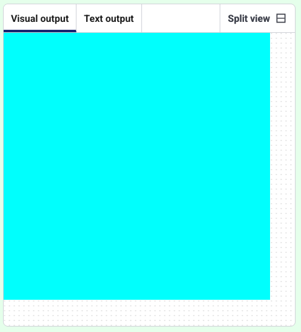

<h2 class="c-project-heading--task">Style the background</h2>
--- task ---
Get started by changing the colour of the background.
--- /task ---

<h2 class="c-project-heading--explainer">Red, green, blue</h2>
The maximum amount of red, green, or blue is `255`. Make sure all your `background` colour values are between `0` and `255`. 

--- task ---
Change the `background` colour experimenting with different values in the starter code.
--- /task ---

--- code ---
---
language: python
line_numbers: true
line_number_start: 1
line_highlights: 5-6
---
from p5 import *
from random import randint

def setup():
    size(400, 400)
    background(0, 255, 255)
--- /code ---

--- task ---
**Test:** Run your project and see the background change the colours in the **Visual output** tab.
--- /task ---

