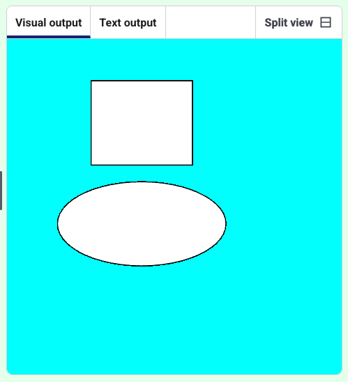

<h2 class="c-project-heading--task">Create shapes</h2>

Use the code below to create a `draw()` function with two shapes.

### Step 1

Adjust the numbers in `rect` and `ellipse` to add shapes to your design.

### Step 2

Copy and paste more rectangles and ellipses in the code to add more shapes. 

--- code ---
---
language: python
filename: main.py
line_numbers: true
line_number_start: 4 
line_highlights: 9-11
---
def setup():
    size(400, 400)
    background(0, 255, 255)  # change background colour

def draw():
    rect(100, 50, 120, 100)
    ellipse(160, 220, 200, 100)
--- /code ---

### Step 3

**Test:** Run your code to draw some shapes.

