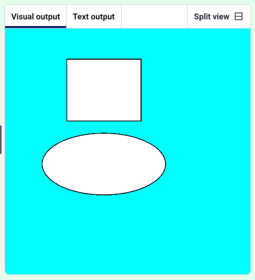

<h2 class="c-project-heading--task">Create shapes</h2>
--- task ---
Create a design with different shapes. 
--- /task ---

--- task ---
Adjust the numbers in `rect` and `ellipse` to add shapes to your design.
--- /task ---

--- task ---
Copy and paste more rectangles and ellipses in the code to add more shapes. 
--- /task ---

--- code ---
---
language: python
filename: main.py
line_numbers: true
line_number_start: 1 
line_highlights: 8-10
---
from p5 import *
from random import randint

def setup():
    size(400, 400)
    background(0, 255, 255)

def draw():
    rect(100, 50, 120, 100)
    ellipse(160, 220, 200, 100)
--- /code ---
--- task ---
**Test:** Run your code to draw some shapes.
--- /task ---

