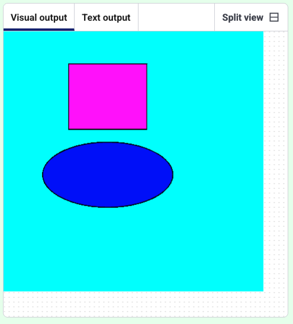

<h2 class="c-project-heading--task">Play with colour</h2>

Add code to `fill()` your shapes with colour and change your shapes transparency.

### Step 1

Adjust the numbers in `fill()` to make different colours.

--- code ---
---
language: python
filename: main.py
line_numbers: true
line_number_start: 9
line_highlights: 10, 12
---
def draw():
    fill(255, 0, 255, 200)
    rect(100, 50, 120, 100)
    fill(0, 0, 255, 100)
    ellipse(160, 220, 200, 100)

--- /code ---

### Step 2

**Test:** Run your code to add colour.

### Tip

In `fill(0, 0, 255, 100)` the first three numbers change the red, green and blue colour values of the shape. The fourth number is the **transparency**. 

