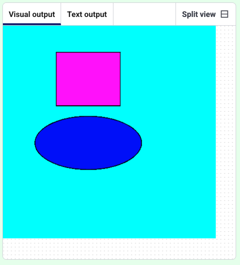

## Play with colour

Add code to `fill()` your shapes with colour and change your shapes' transparency.

Adjust the numbers in `fill()` to make different colours.

```python filename="main.py" line_numbers="true" line_number_start="8" line_highlights="9,11"
def draw():
    fill(255, 0, 255, 255)
    rect(100, 50, 120, 100)
    fill(0, 0, 255, 100)
    ellipse(160, 220, 200, 100)

```

## Now run your code

Check that the shapes are now coloured.



> [!TIP]
>
> In `fill(0, 0, 255, 100)`, the first three numbers change the red, green, and blue colour values of the shape. The fourth number is the **transparency**.

