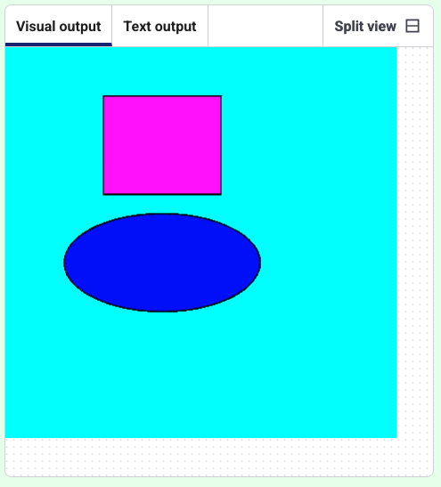

<h2 class="c-project-heading--task">Play with colour</h2>
--- task ---
Add some colour and make your shapes transparent.
--- /task ---

--- task ---
Adjust the numbers in `fill()` to make different colours.
--- /task ---

In `fill(255, 0, 255)` the numbers change the red, green and blue colour values of the shape. 

--- code ---
---
language: python
filename: main.py
line_numbers: true
line_number_start: 8
line_highlights: 9, 11
---
def draw():
    fill(255, 0, 255, 200)
    rect(100, 50, 120, 100)
    fill(0, 0, 255, 100)
    ellipse(160, 220, 200, 100)

--- /code ---
--- task ---
**Test:** Run your code to add colour.
--- /task ---

### Choose the colour, then draw the shape

Decide on what colour you want first with `fill()`, then add the code to draw the shape.

