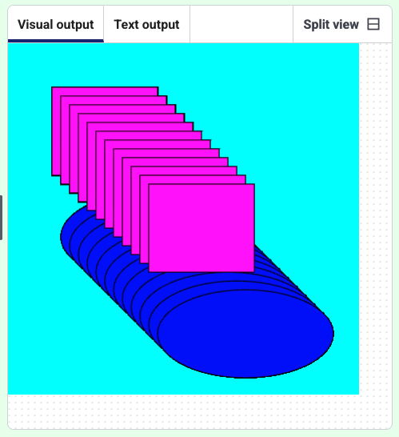

<h2 class="c-project-heading--task">Turn the shapes</h2>

Put your shapes into a loop, and use `translate` to make some repeated patterns.

<h2 class="c-project-heading--explainer">Translate</h2>

`translate` changes the starting position. In a loop these turns the shape a different amount each time.

Put your code into a loop, every time it runs the starting position will change by the numbers you use in `translate()`. 

--- code ---
---
language: python
filename: main.py
line_numbers: true
line_number_start: 9
line_highlights: 10-15
---
def draw():
    for i in range(5):  # Loop 5 times
        fill(255, 0, 255, 255)    
        rect(50, 50, 120, 100) 
        fill(0, 0, 255, 75)
        ellipse(160, 220, 200, 100) 
        translate(10, 10)  # Change the position by 10 on the x and y axis
--- /code ---

## Now run your code

Make a pattern.

### Debugging

Check that code is indented correctly inside the loop.

Confirm the observable result.
