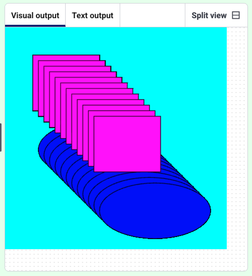

## Turn the shapes

Put your shapes into a loop, and use `translate()` to make some repeated patterns.

> [!INFO]
>
> ## Translate
>
> `translate()` changes the starting position. If you put your code into a loop, every time it runs, the starting position will change by the numbers you use in `translate()`.

```python filename="main.py" line_numbers="true" line_number_start="8" line_highlights="9-14"
def draw():
    for i in range(5):  # Loop 5 times
        fill(255, 0, 255, 255)    
        rect(50, 50, 120, 100) 
        fill(0, 0, 255, 100)
        ellipse(160, 220, 200, 100) 
        translate(10, 10)  # Change the position by 10 on the x and y axes
```

## Now run your code

Check that the shapes repeat to make a pattern.



> [!DEBUG]
>
> Check that your code is indented correctly inside the loop.

