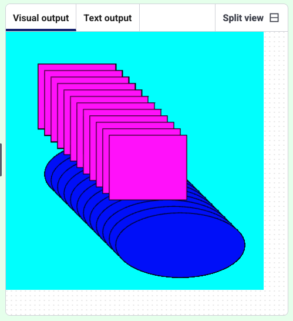

<h2 class="c-project-heading--task">Turn the shapes</h2>
--- task ---

Put your shapes into a loop, and use `translate` to make some repeated patterns.

--- /task ---

<h2 class="c-project-heading--explainer">Translate</h2>
`translate` changes the starting position. In a loop these turns the shape a different amount each time.

--- task ---

Put your code into a loop, every time it runs the starting position will change by the numbers you use in `translate()`. 

--- /task ---

--- code ---
---
language: python
filename: main.py
line_numbers: true
line_number_start: 11
line_highlights: 9-14
---
def draw():
    for i in range(12):  # Loop 12 times
        fill(255, 0, 255, 255)    
        rect(50, 50, 120, 100) 
        fill(0, 0, 255)
        ellipse(160, 220, 200, 100) 
        translate(10, 10)  # Change the position by 10
--- /code ---

--- task ---

**Test:** Run the code and make a pattern.

--- /task ---

### Debugging

Check that code is indented correctly inside the loop.

