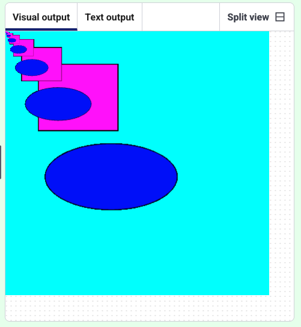

<h2 class="c-project-heading--task">Play with scale</h2>
--- task ---

Use the `scale()` code below to change the size of shapes.

--- /task ---

--- task ---

Comment out the `translate` code, and experiment with `scale`. Using numbers bigger than ‘1’ will make the shape bigger, using a number smaller than ‘1’ will make it smaller.

--- /task ---

--- code ---
---
language: python
filename: main.py
line_numbers: true
line_number_start: 9
line_highlights: 15-16
---
def draw():
    for i in range(5):  # Loop 5 times
        fill(255, 0, 255, 255)    
        rect(50, 50, 120, 100) 
        fill(0, 0, 255, 75)
        ellipse(160, 220, 200, 100) 
        # translate(10,10)
        scale(0.5, 0.5)  # Half size
--- /code ---

--- task ---
**Test:** Run the code to see how your pattern looks.

--- /task ---

### Tip

`scale()` changes the drawing each time the loop runs, so the shapes get smaller and appear in different places.

