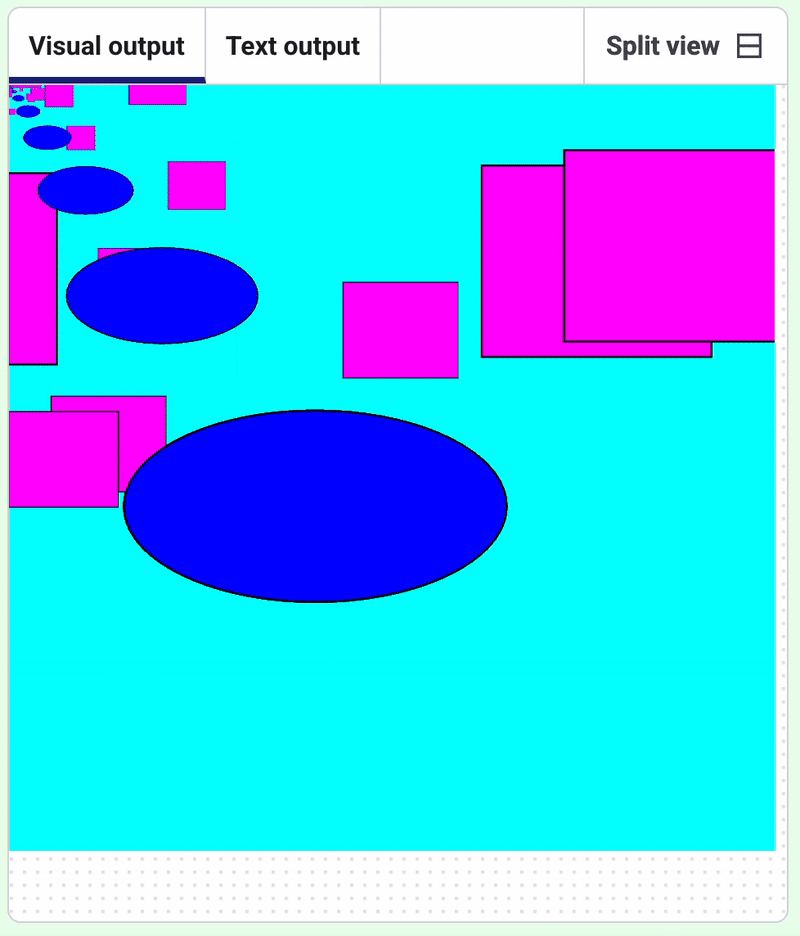

## Random shapes

`randint()` generates a random number. 

Experiment with `randint()` to make animated patterns. Add it to `rect()` to draw rectangles between `-100` and `400`.

```python filename="main.py" line_numbers="true" line_number_start="8" line_highlights="11"
def draw():
    for i in range(5):  # Loop 5 times
        fill(255, 0, 255, 255)    
        rect(randint(-100, 400), randint(-100, 400), 120, 100) 
        fill(0, 0, 255, 100)
        ellipse(160, 220, 200, 100) 
        # translate(10,10)
        scale(0.5, 0.5)  # Half-size
```

## Now run your code

Check that rectangles appear in different random positions.



