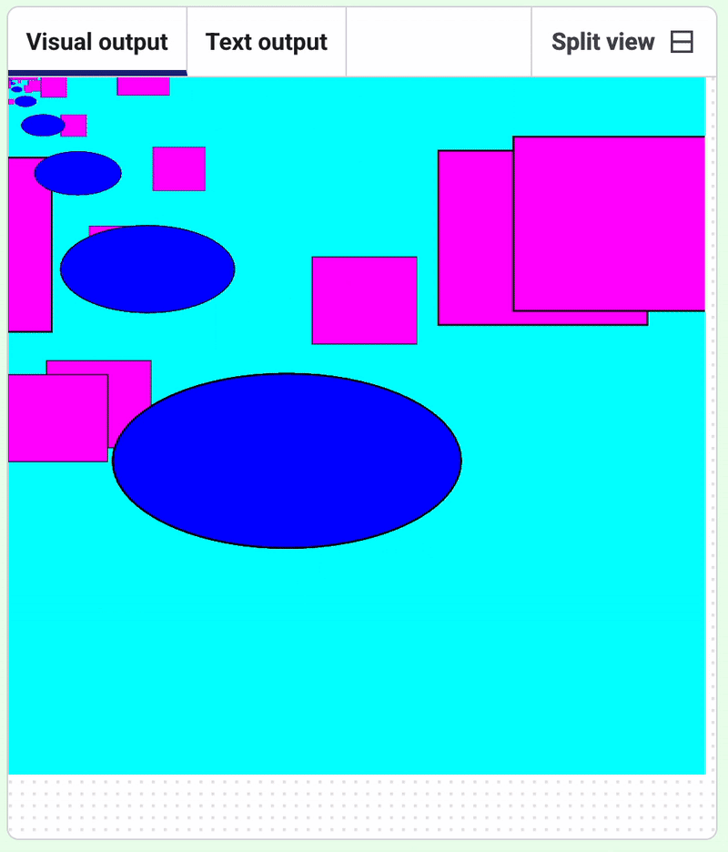

<h2 class="c-project-heading--task">Random shapes</h2>
--- task ---

Experiment with `randint` to make animated patterns

--- /task ---

--- task ---

`randint()` generates a random number. 

Add it to `rect()` to draw rectangles between -100 and 400.

--- /task ---

--- code ---
---
language: python
filename: main.py
line_numbers: true
line_number_start: 9
line_highlights: 12
---
def draw():
    for i in range(5):  # Loop 5 times
        fill(255, 0, 255, 255)    
        rect(randint(-100, 400), randint(-100, 400), 120, 100) 
        fill(0, 0, 255, 75)
        ellipse(160, 220, 200, 100) 
        # translate(10,10)
        scale(0.5, 0.5)  # Half size
--- /code ---

--- task ---

**Test:** Run the code to test it.

--- /task ---

